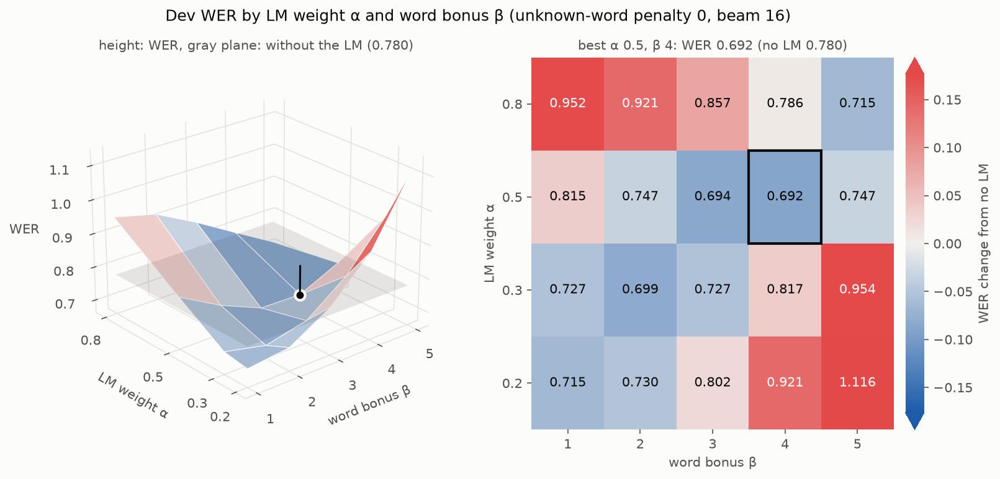

# speech

Speech is an open-source package to build end-to-end models for automatic
speech recognition. Sequence-to-sequence models with attention,
Connectionist Temporal Classification and the RNN Sequence Transducer
are currently supported.

The goal of this software is to facilitate research in end-to-end models for
speech recognition. The models are implemented in PyTorch.

The software requires Python 3.13 or later.

## Install

Install [uv](https://docs.astral.sh/uv/), then from the top level directory run:

```
uv sync
```

This creates a virtual environment with PyTorch and the other requirements and
installs the `speech` package into it. If you need a PyTorch build for a
specific CUDA version, see the
[uv PyTorch guide](https://docs.astral.sh/uv/guides/integration/pytorch/).

You can verify the install was successful by running the tests.

```
uv run pytest
```

## Run 

To train a model run
```
uv run train.py <path_to_config>
```

After the model is done training you can evaluate it with

```
uv run eval.py <path_to_model> <path_to_data_json>
```

To measure how fast a config trains on this machine, and how long an epoch
will take, before starting a long run:

```
uv run benchmark.py <path_to_config>
```

To see the available options for each script use `-h`: 

```
uv run {train, eval}.py -h
```

### Resuming training

After each epoch, `train.py` writes these files to the config's `save_path`:

| File | Contents |
|---|---|
| `model`, `preproc.pyc` | The model after the last epoch, for `eval.py` and `stream.py` |
| `best_model`, `best_preproc.pyc` | The model with the lowest dev CER so far |
| `train_state` | Everything needed to resume: the model, the optimizer state, the epoch and step counts, the best dev CER and the random number generator states |
| `events.out.tfevents.*` | The TensorBoard log |

Each file is written to a temporary file and then renamed, so stopping or
crashing during a save never leaves a broken checkpoint.

To continue a stopped run, give the same command with `--resume`:

```
uv run train.py <path_to_config> --resume
```

- Training continues after the last completed epoch. The progress of an
  unfinished epoch is lost.
- The saved preprocessor is reused. A new one would normalize the features
  with statistics from a different sample of the data.
- The TensorBoard log continues in the same run, and `best_model` is only
  replaced by a model with a lower dev CER than any before the stop.
- On the CPU a resumed run ends with exactly the same weights as a run that
  never stopped. On a GPU it continues the same way, but the weights can differ
  slightly, as GPU kernels can round differently.
- To train for longer than planned, raise `epochs` in the config and resume.
  Keep the rest of the config as it was, since the saved state belongs to that
  model and data.
- A run saved before resume support has no `train_state`. It resumes from its
  last `model` with a new optimizer state, which can make the loss jump for a
  while, and takes its completed epochs and best dev CER from the TensorBoard
  log.

### Data augmentation

Each of these keys in a config's `data` augments the training data, and
none is used for dev. They are applied in this order, each with a chance `p`
of 1 unless set:

| Key | What it does | Example |
|---|---|---|
| `noise` | Mixes random segments of recordings into the audio at a random signal-to-noise ratio in dB, keeping its peak. `source` is a directory of recordings or a dataset json, and `layers` mixes several, as babble from speech. A list adds several overlays. | `{"p" : 0.9, "source" : "examples/noise/data", "snr" : [8, 16]}` |
| `reverb` | Adds reverberation from five comb filters with a random delay in ms and decay per echo in dB, keeping the peak | `{"p" : 0.2, "delay" : [2, 18], "decay" : [0.55, 0.85]}` |
| `volume` | Sets the peak of the audio to a random level in dBFS, where 0 is full scale, clipping what exceeds it | `{"p" : 0.2, "dbfs" : [-13, 7]}` |
| `pitch` | Shifts the pitch by stretching the spectrogram's frequency axis by a random factor | `{"factor" : [0.9, 1.1]}` |
| `tempo` | Speeds speech up or down by stretching the spectrogram's time axis by a random factor, where above 1 is faster | `{"factor" : [0.9, 1.1]}` |
| `spec_augment` | Masks random frequency bands and time spans of the features ([SpecAugment]) | see `examples/commonvoice/ctc_streaming_3750h_gpu_config.json` |

The examples are the settings Mozilla's [DeepSpeech 0.9] trained with, and
the configs in `examples/commonvoice` use all of them, with babble from
LibriSpeech. Where they differ:

- DeepSpeech measured the signal-to-noise ratio between peak levels, which
  gave louder noise for the same numbers than the power ratio here.
- Its volume range of -10 to 10 counts a full-scale peak as 3 dBFS, which is
  -13 to 7 here.
- It also added codec and bandwidth effects, which this repository does not
  have yet.

The reverb is DeepSpeech's, which colors the sound with the tones of its comb
filters. Recorded room impulse responses would sound more natural. For noise,
`examples/noise/download.py` downloads the background noise recordings of
Speech Commands, see `examples/noise/README.md`. The random choices come from
PyTorch's generator, so augmented runs resume exactly.

### Mixed precision and combined datasets

Set `"mixed_precision"` at the top level of a config to compute the network
in a lower precision, which GPUs run much faster:

- `"bf16"`, bfloat16, for NVIDIA A100, H100 and newer GPUs, and Apple silicon.
- `"fp16"`, float16, for older NVIDIA GPUs. float16 has a small range, so the
  gradients are scaled up, and the first few steps of a run can be skipped
  while the scale settles.

The losses are always computed in float32. On CUDA, the matrix products left
in float32 use TF32. On Apple silicon the RNNs stay in float32, since autocast
does not cover them there.

`train_set` and `dev_set` can be lists of dataset json files, to train on
several datasets at once, such as LibriSpeech and Common Voice in
`examples/commonvoice/ctc_streaming_3750h_gpu_config.json`.

## Streaming

A bidirectional encoder needs the whole utterance before it can output
anything. For streaming recognition, use a unidirectional RNN followed by a
lookahead convolution as in [Deep Speech 2]. Set `"bidirectional" : false` and
`"lookahead" : <frames>` in the model's `encoder` config. The lookahead is
counted in encoder frames, after the stride of the convolutional front end. For
example, with 10 ms input frames and a total stride of 2, a lookahead of 10 sees
200 ms of future audio. See `examples/timit/ctc_streaming_config.json`.

To encode audio as it arrives, call `model.encode_stream` with each chunk of
input frames and the state it returned on the previous call. Pass `final=True`
with the last chunk. The streamed outputs match `model.encode` on the full input.

To transcribe live from the microphone with a trained CTC model run

```
uv run stream.py <path_to_model> --mic
```

The transcript grows as you speak, and a pause starts a new line. Stop with
Ctrl+C. Use `--mic-device` to pick a microphone from `uv run python -m
sounddevice`. Given audio files or a dataset json instead of `--mic`,
`stream.py` feeds the audio chunk by chunk and checks the result against
decoding the whole file at once.

### Language model

CTC models can decode with a word bigram language model in the prefix beam
search, both when streaming and in `eval.py`:

```
uv run stream.py <path_to_model> --mic --lm lm.npz
uv run eval.py <path_to_model> <path_to_data_json> --lm lm.npz
```

A word is scored once it is complete, as `lm_weight * log P(word | previous
word) + word_bonus`, plus `unk_penalty` for a word outside the LM's vocabulary.
While streaming, the transcript can change as more audio arrives, and a pause
scores the end of the sentence before starting a new line.

#### Training the language model

`speech.models.word_lm` trains a bigram LM with interpolated absolute
discounting from dataset json files or from text files with one sentence per
line, which may be gzipped. It counts in passes over the text and keeps only
the counts in memory, so the corpus can be far larger than memory. `--dev`
reports the perplexity on a dev set, the lower the better.

The transcripts of the training data make a small LM in about a second:

```
uv run python -m speech.models.word_lm examples/librispeech/data/train.json \
    examples/librispeech/models/lm-train.npz --dev examples/librispeech/data/dev.json
```

For a much larger LM, use the [LibriSpeech LM corpus], 800 million words of
normalized text from 14,500 public domain books:

```
curl -L -o examples/librispeech/data/librispeech-lm-norm.txt.gz \
    https://www.openslr.org/resources/11/librispeech-lm-norm.txt.gz
uv run python -m speech.models.word_lm \
    examples/librispeech/data/librispeech-lm-norm.txt.gz \
    examples/librispeech/models/lm-librispeech.npz \
    --max-vocab 200000 --min-count 3 --dev examples/librispeech/data/dev.json
```

On an 8 GB MacBook Air this took 30 minutes and 2 GB of memory, plus 3.5 GB of
temporary disk space. It keeps the 200,000 most frequent words and the 9.9
million word pairs seen at least three times, in a 171 MB file.

| LM | Text | Vocabulary | Dev perplexity |
|---|---|---|---|
| Training transcripts | 106 thousand words | 11,917 | 584 |
| LibriSpeech LM corpus | 844 million words | 200,003 | 270 |

Best practices for the corpus:

- **Normalize the text like the transcripts.** Use the same characters as the
  acoustic model's labels, lowercase letters, the apostrophe and spaces here,
  with numbers and abbreviations spelled out and no punctuation. The trainer
  lowercases, but a word with other characters can never be decoded and only
  takes probability from the others. The LibriSpeech LM corpus is already
  normalized this way.
- **One sentence per line.** The LM learns how sentences start and end from
  the line breaks, and the decoder scores the end of a sentence at each pause.
- **Keep evaluation text out.** Text from the dev or test sets, even other
  sentences from the same books, which share names and phrasing, makes the
  LM look better than it is. The LibriSpeech LM corpus leaves out the books
  of its dev and test sets.
- **Match the domain.** Text like what will be said matters more than its
  amount. Nineteenth century books suit LibriSpeech but not someone talking
  into a microphone, so add text from your domain when you have it.
- **Bound the size.** `--max-vocab` keeps the most frequent words and
  `--min-count` drops rare word pairs, to keep the model small and fast to
  load. Check the effect on the dev perplexity and WER.
- **Retune the decoder after any change** to the LM or the acoustic model,
  as described next. The best weights depend on both.

#### Tuning the weight, bonus and unknown-word penalty

The LM weight α sets how much the LM counts against the acoustic model, the
word bonus β offsets the LM's preference for fewer, longer words, and the
unknown-word penalty decides how strongly to push misspelled or unknown words
towards words the LM knows. `tune_lm.py` grid searches them on a dev set. It
runs the acoustic model once and then decodes the dev set for each setting in
parallel, ranking the settings by WER:

```
uv run tune_lm.py examples/librispeech/models/ctc_streaming \
    examples/librispeech/data/dev.json \
    --lm examples/librispeech/models/lm-librispeech.npz \
    --weights 0.2,0.3,0.5,0.8 --bonuses 1,2,3,4,5 --unk-penalties 0,-3 \
    --results docs/lm-tuning.json --plot docs/lm-tuning.png
```

It tunes with a beam of 16 to save time. A wider beam then adds a little on
top. With `--from-results` it reports and plots saved results again.

<picture>
  <source media="(prefers-color-scheme: dark)" srcset="docs/lm-tuning-dark.png">
  
</picture>

The plot shows the dev WER over α and β at the best unknown-word penalty, with
blue for settings better than decoding without the LM and red for worse ones.
For the LibriSpeech LM and the streaming CTC model:

- The good settings form a diagonal valley. A stronger LM needs a larger word
  bonus, or it drops and merges words, and too large a bonus inserts words.
- A negative unknown-word penalty only made things worse. The LM already
  gives an unknown word the probability of `<unk>`, the share of all words
  outside its vocabulary.
- The best setting, α 0.5, β 4 and no unknown-word penalty, became the
  default. With a beam of 32 it lowered the dev WER from 0.787 to 0.687 and
  the CER from 0.315 to 0.298.
- The small LM from the training transcripts did as well, WER 0.685, despite
  its higher perplexity. At a CER of 0.3 most words have a wrong letter and
  the LM can only choose among the spellings in the beam, so the acoustic
  model limits the result. The larger LM should help more with a better
  acoustic model and with speech outside LibriSpeech, as its vocabulary is
  17 times larger.

[LibriSpeech LM corpus]: https://www.openslr.org/11/

[Deep Speech 2]: https://arxiv.org/abs/1512.02595
[DeepSpeech 0.9]: https://github.com/mozilla/DeepSpeech/releases/tag/v0.9.0
[SpecAugment]: https://arxiv.org/abs/1904.08779

## Examples

For examples of model configurations and datasets, visit the examples
directory. Each example dataset should have instructions and/or scripts for
downloading and preparing the data. There should also be one or more model
configurations available. The results for each configuration will be documented
in each example's `README.md`.

- `examples/librispeech`: read audiobooks. The streaming CTC model, the
  language model and the decoding described above were tuned on it. Its
  `README.md` has the recipe and the results, a test-clean WER of 0.470 for
  the streaming CTC model trained on 100 hours.
- `examples/commonvoice`: [Mozilla Common Voice], crowd-sourced read speech
  with many speakers, accents and microphones, for training with LibriSpeech
  on a GPU.
- `examples/timit` and `examples/wsj`: the original examples of this
  repository.

[Mozilla Common Voice]: https://commonvoice.mozilla.org
